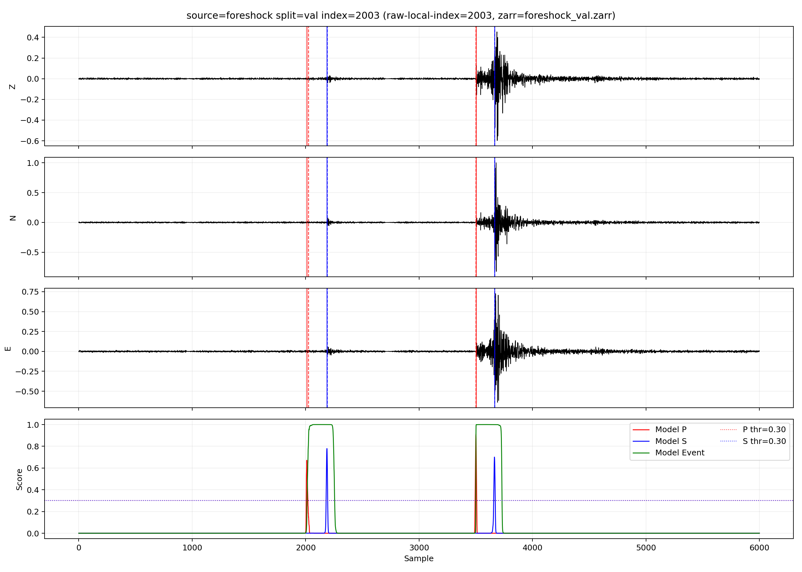
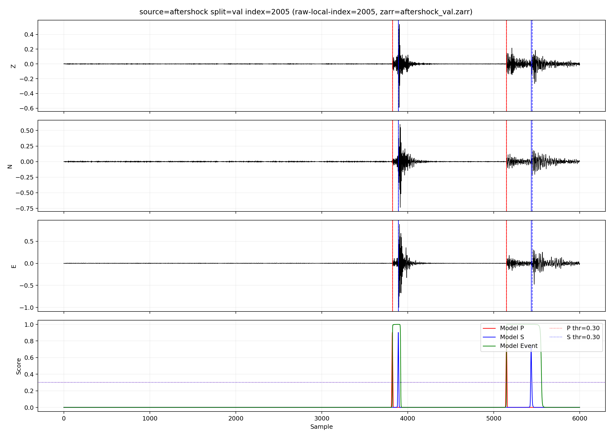
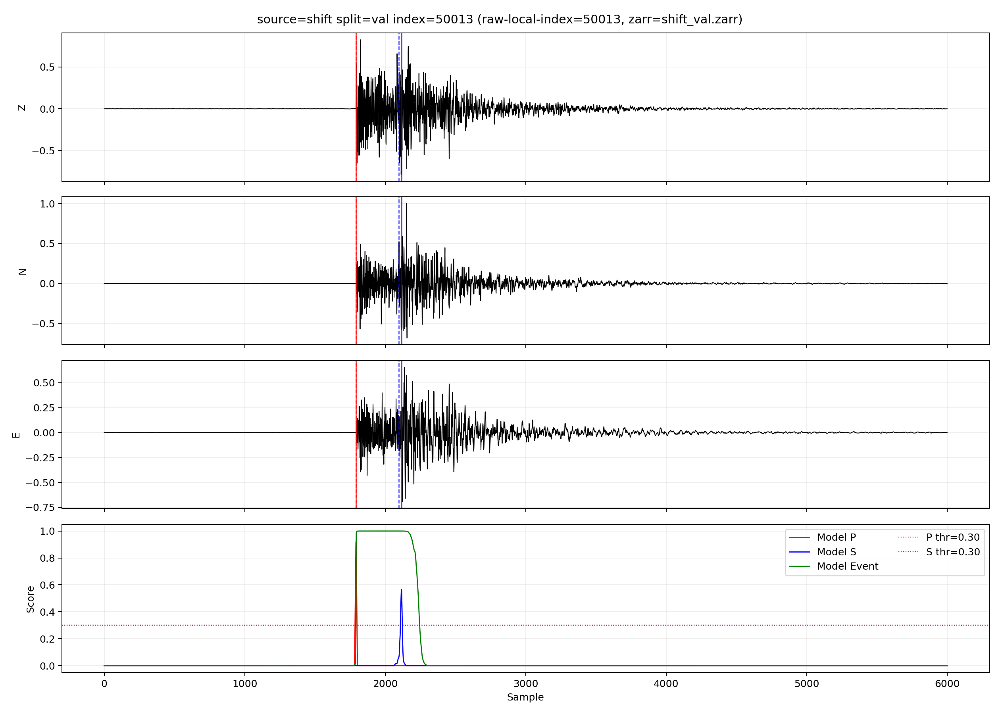
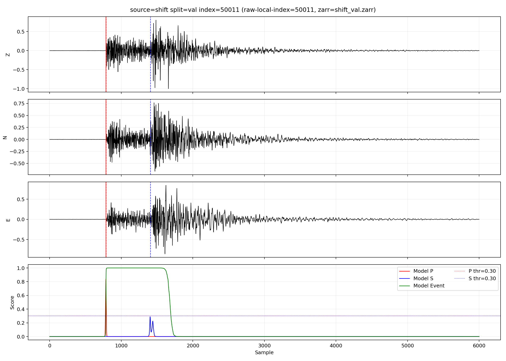

# EQMamba

EQMamba 是一個用於地震波形事件偵測與 P/S 相位挑選（phase picking）的深度學習實驗專案。  
本專案聚焦於以 Mamba 架構為核心模型，搭配資料前處理、訓練流程、評估腳本與可視化工具，方便快速迭代不同模型設定。

## 專案重點
- 以 `EQMamba2x` 為主模型，進行 P/S/Event 三通道預測
- 提供訓練、驗證、測試與 checkpoint 管理流程
- 支援與其他模型（如 PhaseNet、EQTransformer）進行實驗比較
- 包含誤差分布與指標輸出腳本，便於分析模型表現

## 目錄簡介
- `models/`: 模型定義（包含 EQMamba）
- `training/`: 訓練器、loss、metrics 與訓練工具
- `data/`: 資料前處理與資料集讀取
- `configs/`: 訓練與實驗設定檔
- `eval/`: 評估與結果匯出腳本
- `experiment/`: 比較實驗與分析腳本
- `checkpoints/`: 訓練好的模型與指標輸出

## 展示圖
### Foreshock / Aftershock

### Shift Cases

## 使用方式（簡要）
1. 準備資料與設定檔（`configs/`）
2. 執行訓練：`python train.py --config configs/train.yaml`
3. 使用 `eval/` 或 `experiment/` 下的腳本進行評估與比較

---
如果你對地震訊號的 phase picking、模型比較流程，或 Mamba 在時序任務上的應用有興趣，歡迎一起交流與改進。
